# SoundPulse — Does the World Shape Music?

<div align="center">


**A 14-module end-to-end data pipeline that proves world events influence music listening habits —
and generates a custom AI music clip to match next week's predicted chart mood.**

[Live Site](https://tonymelendez77.github.io/soundpulse-pipeline/) · [Mood Intelligence Dashboard](https://soundpulse-mood.streamlit.app) · [Music Trends Dashboard](https://soundpulse-trends.streamlit.app)

</div>

---

## The Question

> *If the world is anxious, does the music go harder? If things calm down, do the charts go euphoric?*

This project tests that hypothesis with real data. It ingests thousands of news articles weekly,
classifies them with a 7-emotion transformer model, clusters chart-topping songs by their acoustic
DNA, and trains a machine learning model to predict the following week's dominant chart mood
from the news sentiment alone.

**Result: 92% accuracy on the test set** — and an AI-generated music clip that sounds like
what next week's charts should feel like.

---

## Live Demo

| Resource | URL |
|---|---|
| 📊 Portfolio Site | https://tonymelendez77.github.io/soundpulse-pipeline/ |
| 🧠 Mood Intelligence Dashboard | https://soundpulse-mood.streamlit.app |
| 🎵 Music Trends Dashboard | https://soundpulse-trends.streamlit.app |
| ⚡ FastAPI Backend | https://soundpulse-api.onrender.com/health |

---

## Architecture

```mermaid
flowchart LR
    subgraph Sources["Data Sources"]
        A1[📰 Guardian API]
        A2[📊 Billboard]
        A3[🎵 iTunes + Last.fm]
        A4[📺 YouTube]
        A5[💬 Reddit]
        A6[🎧 Spotify + Librosa]
    end

    subgraph Ingestion["Ingestion Layer · M1–6"]
        B[Python Batch Scripts]
        C[Google Cloud Storage\nJSONL Lake]
        D[BigQuery Raw\nmusic_analytics]
    end

    subgraph Transform["Transform Layer · M7–8"]
        E[dbt run + test\n15 staging views\n5 mart tables\n82 tests]
    end

    subgraph Analysis["Analysis Layer · M9–12"]
        F[DistilRoBERTa\n7 emotions · 6348 articles]
        G[KMeans k=5\nMood Archetypes]
        H[Pearson r\n50 pairs]
        I[XGBoost + SHAP\n92% accuracy]
    end

    subgraph GenAI["GenAI Layer · M13"]
        J[Pinecone\n1011 track vectors]
        K[MusicGen\n10s AI audio clip]
    end

    subgraph Serving["Serving Layer · M14"]
        L[FastAPI\n8 endpoints]
        M[Streamlit\n2 dashboards]
        N[GitHub Pages\nStatic site]
    end

    Sources --> Ingestion
    B --> C --> D
    D --> E
    E --> Analysis
    F --> G --> H --> I
    I --> GenAI
    J --> K
    GenAI --> Serving
    E --> L --> M
    K --> N
```



---

## Pipeline Modules

| Module | Name | Description | Output |
|---|---|---|---|
| M1 | News Ingestion | Guardian API — 6,348 articles, 8 topics, daily batch | BigQuery `news_raw` |
| M1 | Reddit Ingestion | r/music + r/news, score + comment engagement signals | BigQuery `reddit_raw` |
| M1 | YouTube Ingestion | Trending music videos, multi-country virality signal | BigQuery `youtube_raw` |
| M2 | Spotify Features | Danceability, energy, valence, acousticness per track | BigQuery `spotify_features` |
| M3 | iTunes Trending | Real-time charts across 60+ countries via RSS | BigQuery `itunes_charts` |
| M4 | Last.fm Trending | Global scrobble data, actual listening behaviour | BigQuery `lastfm_charts` |
| M5 | Billboard Hot 100 | Weekly chart rankings + historical backfill (3 months) | BigQuery `billboard_charts` |
| M6 | Librosa Audio DNA | 30 acoustic features per track (MFCCs, chroma, spectral) | BigQuery `audio_features` |
| M7–8 | dbt Transform | 15 staging views, 5 mart tables, 82 data quality tests | `dbt_transformed` dataset |
| M9 | Emotion NLP | DistilRoBERTa 7-emotion classification, batched in 64s | BigQuery `emotion_scores` |
| M10 | KMeans Clustering | k=5 audio mood archetypes, silhouette-optimised | BigQuery `audio_mood_clusters` |
| M11 | Pearson Correlation | 50 emotion × mood pairs, computed in BigQuery CORR() | BigQuery `emotion_music_corr` |
| M12 | XGBoost + SHAP | Lag-1 prediction: this week's news → next week's mood | BigQuery `ml_predictions` |
| M13a | Pinecone Index | 1,011 tracks as 30-dim vectors, cosine similarity search | Pinecone index |
| M13b | MusicGen | Top-10 similar tracks → acoustic prompt → 10s audio clip | GCS WAV + BigQuery log |
| M14 | FastAPI + Serving | 8 JSON endpoints, 2 Streamlit dashboards, static export | This site |

---

## Key Findings

| Finding | Value |
|---|---|
| XGBoost prediction accuracy | **92%** on test set |
| Strongest correlation | `disgust → aggressive` (r = 0.30★) |
| Top SHAP feature | `avg_neutral` — when news goes flat, aggressive music fills the void |
| Weeks of data | 16 weeks of pipeline history |
| Articles classified | 6,348 Guardian articles |
| Tracks in vector index | 1,011 tracks across Billboard, iTunes, Last.fm |
| AI audio generated | 10-second MusicGen clip, regenerated weekly |

---

## Tech Stack

| Layer | Technologies |
|---|---|
| Language | Python 3.11 |
| Cloud | Google Cloud Platform (BigQuery, Cloud Storage) |
| Transformation | dbt-bigquery |
| NLP | Hugging Face Transformers — `j-hartmann/emotion-english-distilroberta-base` |
| ML | XGBoost, scikit-learn, SHAP |
| Audio | Librosa, pydub, soundfile |
| GenAI | `facebook/musicgen-small` (PyTorch + Transformers) |
| Vector DB | Pinecone (30-dim cosine similarity) |
| Orchestration | **Prefect Cloud** (free tier) + **GitHub Actions** (daily 2am UTC) |
| Backend | FastAPI + Uvicorn |
| Frontend | Streamlit (dashboards), Plotly.js (static site) |
| Hosting | GitHub Pages + Render.com + Streamlit Community Cloud |
| CI/CD | GitHub Actions |

---

## Project Structure

```
soundpulse-pulseiq/
├── ingestion/                  # M1–M13 pipeline scripts
│   ├── news_ingestion.py
│   ├── reddit_ingestion.py
│   ├── youtube_ingestion.py
│   ├── spotify_ingestion.py
│   ├── itunes_ingestion.py
│   ├── lastfm_ingestion.py
│   ├── historical_backfill.py
│   ├── audio_features_librosa.py
│   ├── emotion_classification.py
│   ├── audio_clustering.py
│   ├── emotion_music_correlation.py
│   ├── ml_predictions.py
│   ├── pinecone_index.py
│   └── music_generation.py
│
├── soundpulse_dbt/             # dbt project (15 staging + 5 mart models)
│
├── serving/
│   ├── api.py                  # FastAPI backend (8 endpoints)
│   ├── dashboard_mood.py       # Streamlit — Mood Intelligence
│   ├── dashboard_trends.py     # Streamlit — Music Trends
│   └── export_static.py        # Exports JSON snapshots → docs/data/
│
├── orchestration/
│   ├── prefect_pipeline.py     # Prefect flow — all 14 modules
│   └── write_run_log.py        # Appends run record to docs/data/pipeline_runs.json
│
├── docs/                       # GitHub Pages static site
│   ├── index.html              # Full portfolio site (Plotly.js charts)
│   ├── data/                   # JSON data snapshots (auto-refreshed daily)
│   └── audio/track.wav         # AI-generated music clip
│
├── .github/workflows/
│   └── daily_pipeline.yml      # GitHub Actions — Prefect worker, daily 2am UTC
│
├── requirements_api.txt        # Render.com (FastAPI only)
├── requirements_pipeline.txt   # GitHub Actions (full pipeline)
└── render.yaml                 # Render.com config
```

---

## How It Runs (Zero Local Dependencies)

Every day at **02:00 UTC**, GitHub Actions spins up a fresh Ubuntu runner,
authenticates to Prefect Cloud and Google Cloud, executes all 14 pipeline modules
in dependency order, then commits the refreshed data to `docs/` and pushes —
which automatically updates the GitHub Pages site.

```
02:00 UTC
   │
   ├── GitHub Actions starts runner
   ├── Prefect Cloud logs every task in real time (app.prefect.cloud)
   ├── M1–M6: ingest from 6 APIs (parallel where possible)
   ├── M7–8: dbt run + 82 tests
   ├── M9: emotion NLP on all new articles
   ├── M10–11: clustering + correlation
   ├── M12: XGBoost prediction + SHAP
   ├── M13: Pinecone upsert + MusicGen audio
   ├── M14: export_static.py → docs/data/*.json
   └── git commit + push → GitHub Pages updates
```

**Cost: $0/month** (GitHub Actions free tier + Render free + Streamlit free + Prefect free + BigQuery free tier)

---

## Running Locally

```bash
# Clone
git clone https://github.com/tonymelendez77/soundpulse-pipeline.git
cd soundpulse-pipeline

# Install (full pipeline)
pip install -r requirements_pipeline.txt

# Set GCP credentials
export GOOGLE_APPLICATION_CREDENTIALS=/path/to/service-account-key.json

# Run the full pipeline via Prefect
python orchestration/prefect_pipeline.py

# Or run individual modules
python ingestion/news_ingestion.py
python ingestion/emotion_classification.py
python ingestion/ml_predictions.py

# Export static data and serve the site locally
python serving/export_static.py
python -m http.server 8889 --directory docs/
# → http://localhost:8889

# Run FastAPI backend
uvicorn serving.api:app --reload --port 8000

# Run Streamlit dashboards (separate terminals)
streamlit run serving/dashboard_mood.py --server.port 8501
streamlit run serving/dashboard_trends.py --server.port 8502
```

---

## Environment Variables

| Variable | Where | Description |
|---|---|---|
| `GOOGLE_APPLICATION_CREDENTIALS` | Local / GitHub Actions | Path to GCP service account key |
| `GCP_SERVICE_ACCOUNT_JSON` | Render / Streamlit Cloud | Full JSON string of service account key |
| `PREFECT_API_URL` | GitHub Actions secret | Prefect Cloud workspace API URL |
| `PREFECT_API_KEY` | GitHub Actions secret | Prefect Cloud API key |
| `GCP_SERVICE_ACCOUNT_KEY` | GitHub Actions secret | Raw JSON of GCP key (written to /tmp) |

---

## Author

**Oscar J. Melendez**
📧 oscarj.melendezo@gmail.com

Built as a data engineering + ML + GenAI portfolio project.
Pipeline covers the full modern data stack: ingestion, transformation,
NLP, ML, vector search, generative AI, and production serving.

---

<div align="center">
<sub>Data: Guardian API · Billboard · iTunes · Last.fm · Spotify · YouTube · Reddit</sub>
</div>
